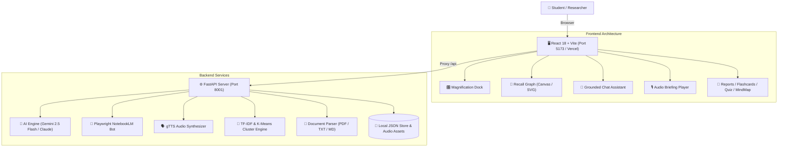

<div align="center">

# 🪐 STYRUD
### The Autonomous AI Study Galaxy: Google NotebookLM + Recall Force-Directed Knowledge Engine

<p align="center">
  <a href="https://styrud-lgf3.vercel.app"></a>
  <a href="https://vercel.com/new/clone?repository-url=https%3A%2F%2Fgithub.com%2Fharinarayana1457-cmyk%2FStyrud"></a>
</p>

[](https://reactjs.org/)
[](https://vitejs.dev/)
[](https://www.typescriptlang.org/)
[](https://fastapi.tiangolo.com/)
[](https://www.python.org/)
[](https://ai.google.dev/)
[](https://playwright.dev/)
[](https://opensource.org/licenses/MIT)

<p align="center">
  <b>Styrud</b> merges the multi-speaker research synthesis of <b>Google NotebookLM</b> with the interactive 2D force-directed knowledge graph of <b>Recall</b>. Transforms lecture notes, PDFs, textbooks, and web links into an animated visual study galaxy.
</p>

[🌐 Live Galaxy](https://styrud-lgf3.vercel.app) • [✨ Key Features](#key-features) • [🏛️ Architecture](#system-architecture) • [🚀 Quickstart](#quickstart-guide) • [📁 Structure](#project-structure) • [🔗 Connect](#connect--contribute)

</div>

---

## 🌟 Key Features

* **🪐 1-Click Google NotebookLM Bridge**: Instantly package workspace sources, download prepared files, copy specialized task prompts to clipboard, or automate via the built-in Playwright bot.
* **🌌 Recall 2D Semantic Galaxy**: Pure Python TF-IDF vectorization & K-Means clustering that automatically decomposes complex documents into interconnected concept nodes with spring physics.
* **🎙️ Multi-Lingual Audio Briefings**: Generates podcast audio overviews in **English + 9 Indian Regional Languages** (Hindi, Telugu, Tamil, Kannada, Marathi, Gujarati, Bengali, Malayalam, Punjabi).
* **🧠 Grounded Source Reasoning**: Multi-turn chat assistant grounded strictly in your uploaded materials with pinpoint slide and section citations.
* **⚡ 10+ Interactive Visualizers**: Instant generation of Study Briefs, Academic Deep Dives, 3D Flashcards, Quizzes with scoring, Slide Decks, Infographics, Data Tables, and Mind Maps.
* **🎛️ macOS Glassmorphism HUD**: Fluid multi-pane panel resizing, glowing indicator borders, and spring-magnification floating dock.

---

## 🏛️ System Architecture



---

## 🚀 Quickstart Guide

### Option 1: Live Deployment (Zero Setup)
Open the production deployment on Vercel:
👉 **[https://styrud-lgf3.vercel.app](https://styrud-lgf3.vercel.app)**

---

### Option 2: Run Locally

#### 1. Clone & Configure Environment
```bash
git clone https://github.com/harinarayana1457-cmyk/Styrud.git
cd Styrud
```
*(Optional)* Create `.env` in the root:
```env
GEMINI_API_KEY=your_gemini_api_key_here
```
> *Runs in **Offline Seeded Mode** with complete built-in study assets if no API key is provided.*

#### 2. Start Backend (FastAPI)
```bash
pip install -r backend/requirements.txt
python -m playwright install chromium
python backend/run_server.py
```
* Backend Root: `http://127.0.0.1:8001` • Interactive API Docs: `http://127.0.0.1:8001/docs`

#### 3. Start Frontend (React + Vite)
In a separate terminal:
```bash
cd frontend
npm install
npm run dev
```
Open **`http://localhost:5173`** in your browser.

---

## 📁 Project Structure

```text
Styrud/
├── backend/
│   ├── services/
│   │   ├── ai.py            # Gemini & Claude prompt orchestration & fallbacks
│   │   ├── audio.py         # Multi-lingual gTTS speech synthesis engine
│   │   ├── cluster.py       # TF-IDF vectorizer & K-Means force-directed graph
│   │   ├── notebooklm_bot.py# Autonomous NotebookLM Playwright browser bridge
│   │   └── parser.py        # PDF, Markdown, and TXT document parser
│   ├── main.py              # FastAPI routes and static mounts
│   └── requirements.txt     # Python dependencies
├── frontend/
│   ├── src/
│   │   ├── components/      # Study cards, Recall graph, audio player, dock
│   │   ├── App.tsx          # Master workspace application shell
│   │   └── index.css        # Glassmorphism styling and typography
│   ├── package.json         # React & Vite dependencies
│   └── vite.config.ts       # Proxy configuration to backend port 8001
├── .gitignore               # Production ignore rules
└── README.md                # Project documentation
```

---

## 🔗 Connect & Contribute

* **Author**: [Hari Narayana (@harinarayana1457-cmyk)](https://github.com/harinarayana1457-cmyk)
* **LinkedIn**: [](https://www.linkedin.com/in/hari-narayana-035ba1389/)
* Distributed under the **[MIT License](https://opensource.org/licenses/MIT)**.
