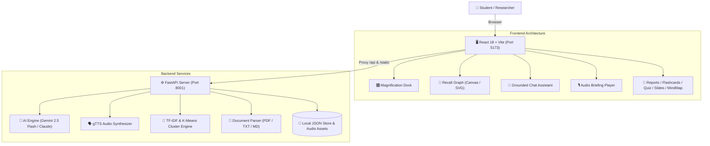

<div align="center">

# 🪐 STYRUD
### The Autonomous AI Study Galaxy: Google NotebookLM + Recall Force-Directed Knowledge Engine

[](https://reactjs.org/)
[](https://vitejs.dev/)
[](https://www.typescriptlang.org/)
[](https://fastapi.tiangolo.com/)
[](https://www.python.org/)
[](https://ai.google.dev/)
[](https://tailwindcss.com/)
[](https://opensource.org/licenses/MIT)

<p align="center">
  <b>Styrud</b> merges the multi-speaker research synthesis of <b>Google NotebookLM</b> with the interactive 2D force-directed knowledge graph of <b>Recall</b>. Built with an ultra-responsive React + Vite frontend and a resilient FastAPI backend, Styrud transforms lecture notes, PDFs, textbooks, and web links into an animated visual study galaxy.
</p>

[✨ Key Features](#-key-features) • [🏛️ Architecture](#-system-architecture) • [⚡ Quickstart](#-quickstart-guide) • [📖 API Reference](#-api-endpoints-reference) • [📁 Project Structure](#-project-structure) • [🔗 Connect](#-connect--contribute)

</div>

---

## 🌟 Highlights & What Makes Styrud Better

* **🪐 Seamless Google NotebookLM Bridge**: Instantly package workspace sources, download prepared files, copy specialized task prompts to clipboard, and launch official Google NotebookLM with 1 click.
* **🧠 Grounded Source Reasoning with Citations**: Multi-turn reasoning chat assistant grounded strictly in your uploaded materials with pinpoint slide and section citations.
* **🌌 Recall 2D Semantic Knowledge Galaxy**: Pure Python TF-IDF vectorization & K-Means clustering that automatically decomposes complex documents into interconnected concept nodes with spring physics.
* **🎙️ Multi-Lingual Audio Briefings**: Generates podcast audio overviews in **English + 9 Indian Regional Languages** (Hindi, Telugu, Tamil, Kannada, Marathi, Gujarati, Bengali, Malayalam, Punjabi) with in-browser audio streaming.
* **⚡ 10+ Integrated Visualizers**: Instant generation of Study Briefs, Academic Reports, Active Recall Flashcards, Quizzes with scoring, Video Slide Decks, Infographics, Comparison Data Tables, and Mind Maps.
* **🎛️ macOS Glassmorphism Interface**: Fluid multi-pane panel resizing, glowing indicator borders, spring-magnification floating dock, and dark mode aesthetics.
* **🛡️ Resilient Dual-Mode Backend**: Seamlessly harnesses Google Gemini 2.5 Flash / Claude 3 with automatic, offline-ready fallback generators to guarantee zero downtime.

---

## 🚀 Key Features

### 1. 📑 Executive Study Briefings & Academic Research Reports
* **Executive Summary**: Generates high-yield study briefs highlighting core pillars, formulas, and operational definitions.
* **Academic Deep Dive**: Comprehensive multi-section Markdown research reports covering abstract, architecture, mechanics, comparative analysis, and engineering selection parameters.

### 2. 🌌 Recall Force-Directed Semantic Cluster Graph
* **Semantic Galaxy**: Visualizes documents and concepts as interactive radial nodes with similarity-weighted connecting edges.
* **Section Decomposition**: Automatically segments multi-page lectures into conceptual nodes across distinct thematic clusters.
* **Interactive Navigation**: Drag, pan, zoom, inspect node clusters, and filter active study cards with a single click.

### 3. 🎙️ Multi-Lingual Audio Overview (NotebookLM Podcast Engine)
* Converts complex study material into natural audio briefings.
* **Language Support**: English (`en`), Hindi (`hi`), Telugu (`te`), Tamil (`ta`), Kannada (`kn`), Marathi (`mr`), Gujarati (`gu`), Bengali (`bn`), Malayalam (`ml`), and Punjabi (`pa`).
* Native audio playback controls directly in the workspace interface.

### 4. 🧩 Active Recall Flashcards
* 3D animated flip cards with front concept prompts and back comprehensive explanations.
* Active mastery tracking to test retention for exam prep.

### 5. 📝 Interactive Evaluation Quiz
* 5 challenging multiple-choice questions with 4 distinct options.
* Real-time automated scoring, instant status glows, and concept explanations for every answer.

### 6. 📽️ Video Overview & Slide Deck Presentation
* Visual slide presentation reader with structured bullet points and visual illustration cues.
* Seamlessly links active bullet points to the synchronized speech audio.

### 7. 🌳 Hierarchical Mind Map & Visual Trees
* Interactive hierarchical node tree mapping out high-level themes to granular definitions across 3–4 conceptual tiers.

### 8. 📊 Comparative Data Tables & Infographics
* **Comparison Matrix**: Structured tabular breakdowns distinguishing architectures, historical milestones, and parameter limits.
* **Infographic Timelines**: Visual process timelines, milestone progression, and metric cards.

---

## 🛠️ System Architecture



---

## ⚡ Quickstart Guide

### Prerequisites
* **Node.js**: v18 or later
* **Python**: 3.10 to 3.14+
* **Git**

---

### Step 1: Clone the Repository
```bash
git clone https://github.com/harinarayana1457-cmyk/Styrud.git
cd Styrud
```

### Step 2: Configure Environment (Optional API Key)
Create a `.env` file in the project root:
```env
GEMINI_API_KEY=your_gemini_api_key_here
ANTHROPIC_API_KEY=your_optional_claude_key_here
```
> *Note: If no API key is provided, Styrud automatically runs in **Offline Seeded Mode** with complete built-in study assets.*

---

### Step 3: Start the Backend (FastAPI)
```bash
# Install dependencies
cd backend
pip install -r requirements.txt

# Start FastAPI server on port 8001
python -m uvicorn main:app --host 127.0.0.1 --port 8001
```
* Backend Root: `http://127.0.0.1:8001`
* Interactive API Documentation (Swagger UI): `http://127.0.0.1:8001/docs`

---

### Step 4: Start the Frontend (Vite)
Open a new terminal window:
```bash
cd frontend

# Install Node dependencies
npm install

# Start Vite dev server
npm run dev
```
* Frontend Application: **`http://localhost:5173`**

---

## 📖 API Endpoints Reference

| Method | Endpoint | Description |
|---|---|---|
| `GET` | `/` | API Status & Service Discovery |
| `GET` | `/api/status` | Server Health & Configured AI Models |
| `GET` | `/api/assets` | List all uploaded workspace sources |
| `POST` | `/api/upload` | Upload PDF, TXT, or MD study files |
| `POST` | `/api/add-link` | Add URL study bookmark or content snippet |
| `DELETE` | `/api/delete-asset/{id}` | Remove a source document from workspace |
| `GET` | `/api/cluster` | Get 2D TF-IDF semantic clusters & force-directed nodes |
| `GET` | `/api/generate/summary` | Generate Executive Study Briefing in Markdown |
| `GET` | `/api/generate/report` | Generate In-Depth Academic Research Report |
| `GET` | `/api/generate/quiz` | Generate 5-question multiple choice quiz with rationales |
| `GET` | `/api/generate/flashcards` | Generate active recall study cards |
| `GET` | `/api/generate/slides` | Generate presentation deck with visual cues |
| `GET` | `/api/generate/infographic` | Generate structured process & timeline infographics |
| `GET` | `/api/generate/mindmap` | Generate hierarchical concept tree |
| `GET` | `/api/generate/datatable` | Generate structured comparative data matrices |
| `POST` | `/api/ask` | Multi-turn reasoning Q&A with grounded source citations |
| `POST` | `/api/audio-overview` | Synthesize multi-lingual MP3 audio podcast |
| `POST` | `/api/save-keys` | Hot-update API credentials without restarting server |

---

## 📁 Project Structure

```text
Styrud/
├── backend/
│   ├── services/
│   │   ├── ai.py                    # Gemini & Claude prompt orchestration & fallback generators
│   │   ├── audio.py                 # Multi-lingual gTTS speech synthesis engine
│   │   ├── cluster.py               # TF-IDF vectorizer & K-Means force-directed graph builder
│   │   ├── notebooklm_bot.py        # Autonomous NotebookLM browser automation bridge
│   │   └── parser.py                # Multi-format document parser (PDF, Markdown, TXT)
│   ├── main.py                      # FastAPI application routes, CORS, and static file mount
│   ├── requirements.txt             # Python dependencies (FastAPI, uvicorn, scikit-learn, etc.)
│   └── run_server.py                # Standalone Python server runner
├── frontend/
│   ├── src/
│   │   ├── components/
│   │   │   ├── AudioOverview.tsx    # Multi-lingual audio podcast player with speed controls
│   │   │   ├── DataTableViewer.tsx  # Interactive comparison data table viewer
│   │   │   ├── FlashcardViewer.tsx  # 3D interactive active recall flashcards
│   │   │   ├── InfographicViewer.tsx# Process timeline and infographic cards
│   │   │   ├── MagnificationDock.tsx# macOS-inspired spring-magnification floating dock
│   │   │   ├── MindMapViewer.tsx    # Interactive hierarchical concept trees
│   │   │   ├── NotebookLMModal.tsx  # NotebookLM direct clipboard & upload bridge
│   │   │   ├── QuizViewer.tsx       # Interactive scoring quiz with rationales
│   │   │   ├── RecallGraph.tsx      # Force-directed 2D semantic galaxy canvas
│   │   │   ├── ReportsViewer.tsx    # Executive briefings and academic research deep dives
│   │   │   ├── SlideDeckViewer.tsx  # Video slide presentation viewer
│   │   │   └── StyrudDashboard.tsx  # Master multi-pane workspace layout
│   │   ├── utils/
│   │   │   └── notebooklmBridge.ts  # Client-side source packager & clipboard utility
│   │   ├── App.tsx                  # Root React application component
│   │   ├── main.tsx                 # Vite DOM mount entrypoint
│   │   └── index.css                # Custom glassmorphism styling & typography
│   ├── package.json                 # Node dependencies and build scripts
│   ├── tailwind.config.js           # Tailwind CSS theme & plugin extensions
│   ├── tsconfig.json                # TypeScript compiler configuration
│   └── vite.config.ts               # Vite proxy configuration to backend port 8001
├── .gitignore                       # Production ignore rules (env, node_modules, venv, cache)
└── README.md                        # Project documentation
```

---

## 🔒 Secure Credentials

Styrud adheres to strict API key security standards:
- API keys are entered via the **Model Credentials Config** modal in the UI or in `.env`.
- The root `.env` file is excluded from Git tracking via `.gitignore`.
- Keys are hot-reloaded directly in FastAPI memory without requiring a server reboot.

---

## 🔗 Connect & Contribute

* **Author**: [Hari Narayana (@harinarayana1457-cmyk)](https://github.com/harinarayana1457-cmyk)
* **LinkedIn**: [](https://www.linkedin.com/in/hari-narayana-035ba1389/)
* Contributions, issues, and feature requests are warmly welcomed!

---

## 📄 License & Typography

* **Codebase**: Distributed under the **[MIT License](https://opensource.org/licenses/MIT)**.
* **Typography**: Bagnard Sans Typography licensed under the [SIL Open Font License (OFL)](https://github.com/sebsan/Bagnard-Sans/blob/master/OFL.txt).
