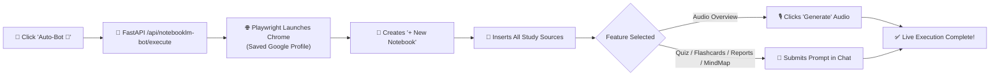
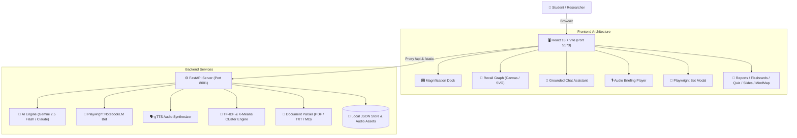

<div align="center">

# 🪐 STYRUD
### The Autonomous AI Study Galaxy: Google NotebookLM + Recall Force-Directed Knowledge Engine

<p align="center">
  <a href="https://github.com/harinarayana1457-cmyk/Styrud"></a>
  <a href="https://vercel.com/new/clone?repository-url=https%3A%2F%2Fgithub.com%2Fharinarayana1457-cmyk%2FStyrud"></a>
  <a href="http://localhost:5173"></a>
  <a href="http://127.0.0.1:8001/docs"></a>
  <a href="https://notebooklm.google.com"></a>
  <a href="https://playwright.dev"></a>
</p>

<p align="center">
  <a href="https://vercel.com/new/clone?repository-url=https%3A%2F%2Fgithub.com%2Fharinarayana1457-cmyk%2FStyrud">
    
  </a>
</p>

<p align="center">
  
  
  
  
  
  
  
  
</p>

---

<p align="center">
  <b>Styrud</b> merges the multi-speaker research synthesis of <b>Google NotebookLM</b> with the interactive 2D force-directed knowledge graph of <b>Recall</b>. Built with an ultra-responsive glassmorphic React + Vite interface, a resilient FastAPI backend, and an autonomous <b>Playwright Browser Automation Bot</b>, Styrud transforms lecture notes, PDFs, textbooks, and web links into an animated visual study galaxy.
</p>

[📖 About](#-about-styrud) • [🚀 1-Click Deploy](#-1-click-deploy-to-vercel) • [✨ Highlights](#-highlights--what-makes-styrud-better) • [🤖 Playwright Bot](#-autonomous-notebooklm-playwright-bot) • [🚀 Key Features](#-key-features) • [⚡ Local Setup](#-quickstart-guide) • [📖 API Reference](#-api-endpoints-reference)

</div>

---

## 📖 About Styrud

> **🪐 Styrud** is an autonomous AI-powered study galaxy that merges the multi-speaker research synthesis of **Google NotebookLM** with the interactive 2D force-directed knowledge graph of **Recall**.

| Resource | Link / Access |
|---|---|
| **🚀 Vercel 1-Click Deployment** | [**Deploy to Vercel**](https://vercel.com/new/clone?repository-url=https%3A%2F%2Fgithub.com%2Fharinarayana1457-cmyk%2FStyrud) |
| **🐙 GitHub Repository** | [**github.com/harinarayana1457-cmyk/Styrud**](https://github.com/harinarayana1457-cmyk/Styrud) |
| **⚡ Local Frontend** | `http://localhost:5173` |
| **⚙️ Local Backend API** | `http://127.0.0.1:8001` (Swagger: `/docs`) |
| **🪐 Google NotebookLM** | `https://notebooklm.google.com` |

---

## 📊 Feature Comparison: Styrud vs. Others

| Feature | Standard NotebookLM | Recall | 🪐 **Styrud** |
|---|:---:|:---:|:---:|
| **Grounded Source Q&A with Citations** | ✅ | ❌ | ✅ **Multi-turn with slide references** |
| **Interactive 2D Semantic Knowledge Galaxy** | ❌ | ✅ | ✅ **Force-directed TF-IDF graph** |
| **Multi-Lingual Audio Briefings** | English only | ❌ | ✅ **English + 9 Indian Languages** |
| **Automated Playwright Browser Bot** | ❌ | ❌ | ✅ **Creates notebooks & uploads sources** |
| **1-Click Source Packager & Prompt Bridge** | ❌ | ❌ | ✅ **Auto-downloads & copies prompts** |
| **Active Recall Flashcards (3D Flip)** | ❌ | ❌ | ✅ **Interactive flip cards & mastery** |
| **Interactive Scored Evaluation Quizzes** | ❌ | ❌ | ✅ **5-question quiz with explanations** |
| **Hierarchical Concept Mind Maps** | ❌ | ❌ | ✅ **Visual 4-tier tree visualizer** |
| **Slide Deck Presentations & Timelines** | ❌ | ❌ | ✅ **Structured slide reader & infographics** |
| **Resilient Offline Dual-Engine Fallback** | ❌ | ❌ | ✅ **Zero-downtime offline generator** |

## 🚀 1-Click Deploy to Vercel

Deploy your own instance of Styrud directly to Vercel with a single click:

<p align="center">
  <a href="https://vercel.com/new/clone?repository-url=https%3A%2F%2Fgithub.com%2Fharinarayana1457-cmyk%2FStyrud">
    
  </a>
</p>

### Deployment Instructions:
1. Click the **Deploy with Vercel** button above.
2. Sign in with your GitHub account to fork and clone the repository.
3. Add the optional Environment Variable:
   * `GEMINI_API_KEY`: *(Optional)* Your Google Gemini API Key from [Google AI Studio](https://aistudio.google.com/).
4. Click **Deploy** — Vercel will build and launch your live study galaxy in seconds!

---

## 🌟 Highlights & What Makes Styrud Better

* 🤖 **Autonomous Google NotebookLM Playwright Bot**: Direct browser automation that logs into Google, creates a new notebook, inserts your sources, and executes audio generation or specialized prompts with zero manual clicking.
* 📦 **Seamless 1-Click Fast Bridge**: Instant source packaging that downloads `Styrud_NotebookLM_Sources.txt`, copies specialized structured task prompts to your clipboard, and launches NotebookLM in one click.
* 🧠 **Grounded Source Reasoning with Citations**: Multi-turn reasoning chat assistant grounded strictly in your uploaded materials with pinpoint slide and section citations.
* 🌌 **Recall 2D Semantic Knowledge Galaxy**: Pure Python TF-IDF vectorization & K-Means clustering that automatically decomposes complex documents into interconnected concept nodes with spring physics.
* 🎙️ **Multi-Lingual Audio Briefings**: Generates podcast audio overviews in **English + 9 Indian Regional Languages** (Hindi, Telugu, Tamil, Kannada, Marathi, Gujarati, Bengali, Malayalam, Punjabi) with in-browser audio streaming.
* ⚡ **10+ Integrated Visualizers**: Instant generation of Study Briefs, Academic Reports, Active Recall Flashcards, Quizzes with scoring, Video Slide Decks, Infographics, Comparison Data Tables, and Mind Maps.
* 🎛️ **macOS Glassmorphism Interface**: Fluid multi-pane panel resizing, glowing indicator borders, spring-magnification floating dock, and dark mode aesthetics.
* 🛡️ **Resilient Dual-Mode Backend**: Seamlessly harnesses Google Gemini 2.5 Flash / Claude 3 with automatic, offline-ready fallback generators to guarantee zero downtime.

---

## 🤖 Autonomous NotebookLM Playwright Bot

Styrud includes a dedicated **Playwright Browser Bot** that automates the exact workflow inside Google NotebookLM:



### How to use the Bot:
1. Click the **`Auto-Bot 🤖`** button in the top navigation bar or the **`Bot 🤖`** badge on any tool card.
2. Toggle **Visible Browser Window** if you want to watch Chrome perform the actions in real-time.
3. Click **"Launch Bot in NotebookLM"** — the bot will automatically handle notebook creation, source pasting, and task execution!

---

## 🚀 Key Features

<div align="center">

### 📑 1. Academic Research Reports & Executive Briefings
* **Executive Summary**: High-yield study briefs highlighting core pillars, formulas, and operational definitions.
* **Academic Deep Dive**: Comprehensive multi-section Markdown research reports covering abstract, architecture, mechanics, comparative analysis, and engineering selection parameters.

### 🌌 2. Recall Force-Directed Semantic Cluster Graph
* **Semantic Galaxy**: Visualizes documents and concepts as interactive radial nodes with similarity-weighted connecting edges.
* **Section Decomposition**: Automatically segments multi-page lectures into conceptual nodes across distinct thematic clusters.
* **Interactive Navigation**: Drag, pan, zoom, inspect node clusters, and filter active study cards with a single click.

### 🎙️ 3. Multi-Lingual Audio Overview (NotebookLM Podcast Engine)
* Converts complex study material into natural audio briefings.
* **10 Supported Languages**: English (`en`), Hindi (`hi`), Telugu (`te`), Tamil (`ta`), Kannada (`kn`), Marathi (`mr`), Gujarati (`gu`), Bengali (`bn`), Malayalam (`ml`), and Punjabi (`pa`).
* Native audio playback controls directly in the workspace interface.

### 🧩 4. Active Recall Flashcards & Interactive Quizzes
* **3D Animated Flashcards**: Front concept prompts with comprehensive back explanations and mastery tracking.
* **Evaluation Quiz**: 5 challenging multiple-choice questions with real-time automated scoring and detailed concept explanations.

### 📽️ 5. Slide Deck Presentation & Video Overview
* Visual slide presentation reader with structured bullet points, key takeaways, and illustration cues.
* Synchronized video overview walkthrough scripts.

### 🌳 6. Concept Mind Maps, Infographics & Data Tables
* **Mind Maps**: Interactive hierarchical node tree mapping out high-level themes to granular definitions across 4 conceptual tiers.
* **Infographic Timelines**: Visual process timelines, milestone progressions, and metric cards.
* **Comparison Data Matrix**: Structured tabular matrix distinguishing architectures, specifications, and limits.

</div>

---

## 🛠️ System Architecture



---

## ⚡ Quickstart Guide

### Prerequisites
* **Node.js**: v18 or later
* **Python**: 3.10 to 3.14+
* **Git**

---

### Step 1: Clone the Repository
```bash
git clone https://github.com/harinarayana1457-cmyk/Styrud.git
cd Styrud
```

### Step 2: Configure Environment (Optional API Key)
Create a `.env` file in the project root:
```env
GEMINI_API_KEY=your_gemini_api_key_here
ANTHROPIC_API_KEY=your_optional_claude_key_here
```
> *Note: If no API key is provided, Styrud automatically runs in **Offline Seeded Mode** with complete built-in study assets.*

---

### Step 3: Start the Backend (FastAPI)
```bash
# Install Python dependencies
pip install -r backend/requirements.txt

# Install Playwright browser
python -m playwright install chromium

# Start FastAPI server on port 8001
python backend/run_server.py
```
* Backend URL: **`http://127.0.0.1:8001`**
* Interactive API Documentation (Swagger UI): **`http://127.0.0.1:8001/docs`**

---

### Step 4: Start the Frontend (Vite)
Open a new terminal window:
```bash
cd frontend

# Install Node dependencies
npm install

# Start Vite dev server
npm run dev
```
* Frontend Application: **`http://localhost:5173`**

---

## 📖 API Endpoints Reference

| Method | Endpoint | Description |
|---|---|---|
| `GET` | `/` | API Status & Service Discovery |
| `GET` | `/api/status` | Server Health & Configured AI Models |
| `GET` | `/api/assets` | List all uploaded workspace sources |
| `POST` | `/api/upload` | Upload PDF, TXT, or MD study files |
| `POST` | `/api/add-link` | Add URL study bookmark or content snippet |
| `DELETE` | `/api/delete-asset/{id}` | Remove a source document from workspace |
| `GET` | `/api/cluster` | Get 2D TF-IDF semantic clusters & force-directed nodes |
| `GET` | `/api/export-sources` | Package and download all study sources for NotebookLM |
| `GET` | `/api/notebooklm-bot/status` | Check Google login status in Playwright profile |
| `POST` | `/api/notebooklm-bot/login` | Open visible browser window for Google authentication |
| `POST` | `/api/notebooklm-bot/execute` | **Automate Notebook creation, source upload & task execution** |
| `GET` | `/api/generate/summary` | Generate Executive Study Briefing in Markdown |
| `GET` | `/api/generate/report` | Generate In-Depth Academic Research Report |
| `GET` | `/api/generate/quiz` | Generate 5-question multiple choice quiz with rationales |
| `GET` | `/api/generate/flashcards` | Generate active recall study cards |
| `GET` | `/api/generate/slides` | Generate presentation deck with visual cues |
| `GET` | `/api/generate/infographic` | Generate structured process & timeline infographics |
| `GET` | `/api/generate/mindmap` | Generate hierarchical concept tree |
| `GET` | `/api/generate/datatable` | Generate structured comparative data matrices |
| `POST` | `/api/ask` | Multi-turn reasoning Q&A with grounded source citations |
| `POST` | `/api/audio-overview` | Synthesize multi-lingual MP3 audio podcast |
| `POST` | `/api/save-keys` | Hot-update API credentials without restarting server |

---

## 📁 Project Structure

```text
Styrud/
├── backend/
│   ├── services/
│   │   ├── ai.py                    # Gemini & Claude prompt orchestration & fallback generators
│   │   ├── audio.py                 # Multi-lingual gTTS speech synthesis engine
│   │   ├── cluster.py               # TF-IDF vectorizer & K-Means force-directed graph builder
│   │   ├── notebooklm_bot.py        # Autonomous NotebookLM browser automation bridge
│   │   └── parser.py                # Multi-format document parser (PDF, Markdown, TXT)
│   ├── main.py                      # FastAPI application routes, CORS, and static file mount
│   ├── requirements.txt             # Python dependencies (FastAPI, uvicorn, scikit-learn, etc.)
│   └── run_server.py                # Standalone Python server runner
├── frontend/
│   ├── src/
│   │   ├── components/
│   │   │   ├── AudioOverview.tsx    # Multi-lingual audio podcast player with speed controls
│   │   │   ├── DataTableViewer.tsx  # Interactive comparison data table viewer
│   │   │   ├── FlashcardViewer.tsx  # 3D interactive active recall flashcards
│   │   │   ├── InfographicViewer.tsx# Process timeline and infographic cards
│   │   │   ├── MagnificationDock.tsx# macOS-inspired spring-magnification floating dock
│   │   │   ├── MindMapViewer.tsx    # Interactive hierarchical concept trees
│   │   │   ├── NotebookLMModal.tsx  # NotebookLM direct clipboard & upload bridge
│   │   │   ├── QuizViewer.tsx       # Interactive scoring quiz with rationales
│   │   │   ├── RecallGraph.tsx      # Force-directed 2D semantic galaxy canvas
│   │   │   ├── ReportsViewer.tsx    # Executive briefings and academic research deep dives
│   │   │   ├── SlideDeckViewer.tsx  # Video slide presentation viewer
│   │   │   └── StyrudDashboard.tsx  # Master multi-pane workspace layout
│   │   ├── utils/
│   │   │   └── notebooklmBridge.ts  # Client-side source packager & clipboard utility
│   │   ├── App.tsx                  # Root React application component
│   │   ├── main.tsx                 # Vite DOM mount entrypoint
│   │   └── index.css                # Custom glassmorphism styling & typography
│   ├── package.json                 # Node dependencies and build scripts
│   ├── tailwind.config.js           # Tailwind CSS theme & plugin extensions
│   ├── tsconfig.json                # TypeScript compiler configuration
│   └── vite.config.ts               # Vite proxy configuration to backend port 8001
├── .gitignore                       # Production ignore rules (env, node_modules, venv, cache)
└── README.md                        # Project documentation
```

---

## 🔒 Secure Credentials & Privacy

Styrud adheres to strict API key security and user privacy standards:
* **Zero Cookie Leakage**: Playwright session profiles (`backend/.browser_profile/`) and `.env` credentials are encrypted locally on your machine and strictly `.gitignore`'d from Git.
* **In-Memory Hot Reloading**: Keys entered via the in-app Model Credentials modal are instantly activated in FastAPI memory without requiring server reboots.
* **Grounded RAG Guardrails**: All generated outputs are grounded strictly within user-provided source documents.

---

## 🔗 Connect & Contribute

* **Author**: [Hari Narayana (@harinarayana1457-cmyk)](https://github.com/harinarayana1457-cmyk)
* **LinkedIn**: [](https://www.linkedin.com/in/hari-narayana-035ba1389/)
* Contributions, issues, and feature requests are warmly welcomed!

---

## 📄 License & Typography

* **Codebase**: Distributed under the **[MIT License](https://opensource.org/licenses/MIT)**.
* **Typography**: Bagnard Sans Typography licensed under the [SIL Open Font License (OFL)](https://github.com/sebsan/Bagnard-Sans/blob/master/OFL.txt).
